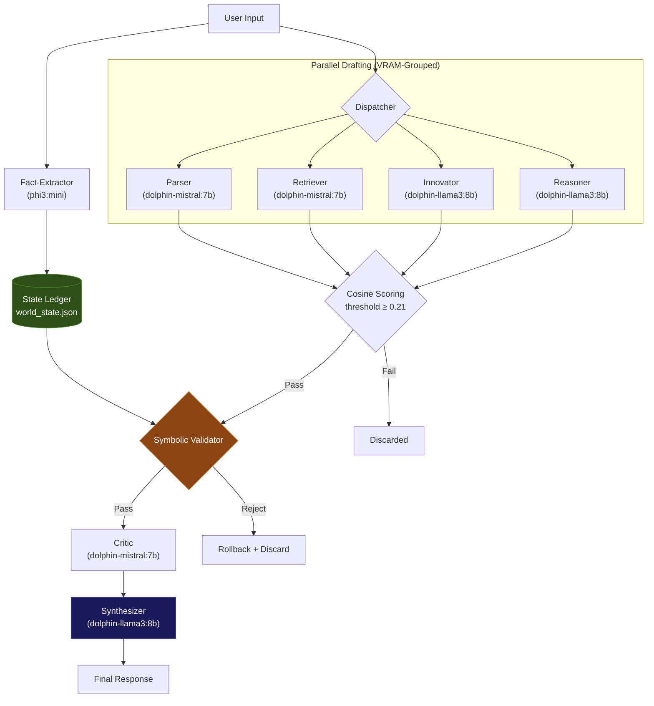
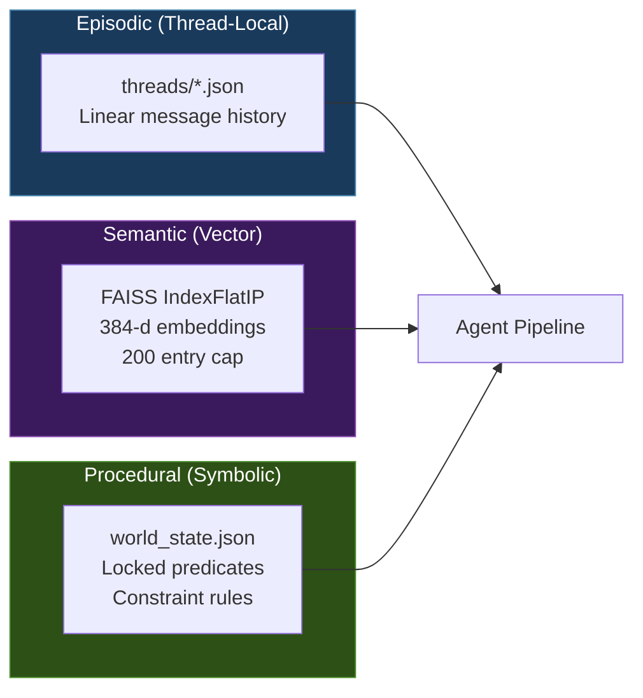

<div align="center">


# Neuro-Symbolic Swarm

**Multi-Agent Orchestration Engine with Symbolic State Anchoring**

*Author: Bradley R. Kinnard*

</div>

<br/>

> **⚠️ ARCHITECTURAL NOTE:**
> This is a **Deep Reasoning Engine**, not a conversational chatbot.
> A typical query involves 7 concurrent agent generations, vector scoring, and symbolic validation.
> **Expected Latency:** 10s – 60s per turn (depending on GPU).
> **Design Priority:** Correctness > Speed.

> **The Architectural Thesis:** This is a research prototype built to study the "Context Drift" and "Hallucination" problems that plague single-model systems. It is a test harness for a deterministic state engine. The core question: *can a 7-agent consensus network running on a single consumer GPU (12 GB VRAM) produce more consistent, fact-stable output than a lone model?* The answer, based on 256 automated tests and adversarial attack simulations, is a qualified yes. The system makes real trade-offs to get there. This document lays out what works, what breaks, and where the boundaries are.

---

## Table of Contents

- [Core Architecture](#core-architecture)
- [Key Innovations](#key-innovations)
- [System Design](#system-design)
- [Local Deployment](#local-deployment)
- [Adversarial Testing](#adversarial-testing)
- [Test Suite](#test-suite)
- [Programmatic API](#programmatic-api)
- [Configuration](#configuration)
- [Project Layout](#project-layout)
- [Limitations and Trade-offs](#limitations-and-trade-offs)
- [Roadmap](#roadmap)

---

## Core Architecture

This system does not simply "chat." It treats conversation as a data processing pipeline where seven agents compete to generate the best response, and a symbolic logic layer vetoes anything that contradicts established facts.

The pipeline in four steps:

1. **Parallel Drafting.** Four agents (Parser, Retriever, Innovator, Reasoner) each generate an independent draft in response to the user's query. Agents sharing a model are batched to avoid doubling the KV cache in VRAM.

2. **Vector Scoring.** Each draft is scored against the original query using `all-MiniLM-L6-v2` (384-d embeddings, cosine similarity, CPU). Drafts below the quality threshold (default: 0.21) are culled immediately.

3. **Symbolic Validation.** Survivors are cross-checked against an immutable State Ledger. Any draft containing anachronisms, fact contradictions, or setting violations is physically rejected before synthesis. If every draft fails, the ledger rolls back to its pre-message state.

4. **Synthesis + Post-Validation.** A final agent folds the validated drafts into one coherent response. The synthesizer receives a constraint block listing all locked facts from the ledger. After synthesis, `_post_synthesis_validate()` re-checks the output for anachronisms and fact contradictions — if the synthesizer introduced violations while rewriting, the system falls back to the best validated draft. Output is then cleaned of any leaked `<reasoning>` tags, prompt instruction echoes, and `<answer>` wrappers.

---

## Key Innovations

### 1. Neuro-Symbolic State Ledger

Most retrieval-augmented systems rely on vector similarity, which is probabilistic. Swarm adds a deterministic layer on top.

**The Mechanism:** A dedicated lightweight model (`phi3:mini`) acts strictly as a fact extractor. It watches every message for concrete entities (dates, locations, names, tech stacks, relationships) and commits them as flat JSON to `data/world_state.json`. Eight predicates are write-locked after first contact:

```
setting   genre   era   timeline   planet   project_name   programming_language   database
```

**The Result:** Once the ledger records `era=medieval`, that value is sealed for the life of the thread. No subsequent hallucination, no creative drift, and no user trick can overwrite it through the normal pipeline. The system creates a "truth anchor" that persists across the entire conversation. The fact contradiction gate runs against **all** locked predicates (not just world anchors), catching age, role, name, and relationship contradictions via explicit patterns and appositive detection (e.g., "Kael the wizard" when `protagonist_role=blacksmith`).

**The Escape Hatch:** Protected predicates are locked against *accidental overwrites from extraction*, not against deliberate resets. The `clear_thread()` method wipes all facts for a thread (including locked ones), and the `delete()` method can remove individual predicates programmatically. If a user genuinely needs to pivot ("Actually, make this a time-travel story"), they start a new thread or the application calls `clear_thread()`.

*Source: `PROTECTED_PREDICATES` in `src/state_manager.py`, line 136. Escape hatch: `clear_thread()` at line 203, `delete()` at line 192.*

### 2. Hard Gating and Rollback

The system implements defense-in-depth against hallucination. This happens in two stages: once on the raw user input (before any agents run), and again on all generated drafts.

**The Mechanism:** Every draft passes through `_symbolic_validate()`. It scans for three categories of violations:

| Check | What It Catches | Example |
|:------|:----------------|:--------|
| Anachronism scan | Terms that violate the era blocklist | "truck" in a medieval setting |
| Fact contradiction | Claims that conflict with locked predicates | Saying `database=MySQL` when the ledger says `CockroachDB` |
| Setting anchor breach | Content that ignores the established world | A scene in outer space when the ledger says `planet=Earth` |

**The Result:** Failing drafts are discarded before the synthesizer sees them. If *all* drafts fail validation, the engine triggers a state rollback: any facts the extractor pulled from the offending message are stripped from the ledger, restoring it to the pre-message baseline.

The medieval era blocklist contains **104 unique terms** spanning transportation, electronics, modern weapons, energy/industrial tech, brand names, media, science, and materials. Multi-word entries like "machine gun" and "social media" match as substrings.

*Source: `ERA_BLOCKLISTS["medieval"]` in `src/constraints.py`, line 21. Rollback: `_rollback_facts()` in `src/swarm.py`.*

### 3. VRAM-Safe Concurrency

Running 7 agents on one GPU normally requires datacenter hardware. Swarm solves this with model-based batching.

**The Mechanism:** Agents are grouped by their underlying model name. The engine runs one agent per model concurrently (different models can coexist in VRAM), but never sends two requests to the same model at the same time. After the drafting phase, all non-synthesizer models are explicitly unloaded via Ollama's `keep_alive: 0` endpoint before synthesis begins.

**The Result:** The full pipeline runs on a standard NVIDIA card with 12 GB VRAM. Three agents sharing `dolphin-mistral:7b` load the model once. The engine avoids double-loading the KV cache, which would OOM on consumer hardware.

*Source: `_run_agents()` at `src/swarm.py`, line 553. `_unload_model()` at line 637.*

---

## System Design

### Pipeline



### Agent Roster

| Agent | Default Model | Temp | Tokens | Threshold | Role |
|:------|:-------------|:----:|:------:|:---------:|:-----|
| Parser | `dolphin-mistral:7b` | 0.30 | 2048 | 0.15 | Direct answers with constraint checking |
| Retriever | `dolphin-mistral:7b` | 0.20 | 2048 | 0.15 | Factual recall, memory-backed search |
| Critic | `dolphin-mistral:7b` | 0.15 | 2048 | 0.15 | Contradiction detection, draft verification |
| Innovator | `dolphin-llama3:8b` | 0.50 | 2048 | 0.10 | Lateral thinking, creative alternatives |
| Reasoner | `dolphin-llama3:8b` | 0.20 | 2048 | 0.10 | Step-by-step chain-of-thought logic |
| Synthesizer | `dolphin-llama3:8b` | 0.20 | 2048 | 0.10 | Combines validated drafts into final output |
| Fact-Extractor | `phi3:mini` | 0.10 | 512 | 0.00 | JSON fact extraction for the state ledger |

*Values pulled directly from each `agents/*.yaml` file.*

### Memory Hierarchy

The engine maintains three memory layers that loosely mirror human cognitive architecture:



| Layer | Type | Store | Function |
|:------|:-----|:------|:---------|
| Episodic | Thread-local | `data/threads/*.json` | Raw linear history of each conversation |
| Semantic | Vector | `data/memory.faiss` + `.json` | Long-term recall via cosine similarity. Stores up to 200 high-value embeddings (`IndexFlatIP`). |
| Procedural | Symbolic | `data/world_state.json` | The rulebook. Extracted facts, locked predicates, world constraints. |

The embedding model (`all-MiniLM-L6-v2`, 384 dimensions) auto-downloads on first launch and runs entirely on CPU.

---

## Local Deployment

### 1. Installation

```bash
git clone https://github.com/moonrunnerkc/neuro-symbolic-swarm.git
cd neuro-symbolic-swarm
python -m venv .venv && source .venv/bin/activate
pip install -r requirements.txt
```

### 2. Model Provisioning (Ollama)

The system is model-agnostic via Ollama's HTTP API, but ships tuned for these defaults:

- **Logic/Extraction:** `phi3:mini` (fast structured JSON output, low VRAM)
- **Drafting/Critique:** `dolphin-mistral:7b` (instruction-following, precise)
- **Synthesis:** `dolphin-llama3:8b` (better prose cohesion)

```bash
ollama pull phi3:mini
ollama pull dolphin-mistral:7b
ollama pull dolphin-llama3:8b
```

Full model catalog at [ollama.com/library](https://ollama.com/library).

### 3. Swapping Models

Every agent reads its model name from a YAML file in `agents/`. To swap any agent to a different model, edit that one line:

```yaml
# agents/reasoner.yaml
role: Reasoner
model: dolphin-llama3:8b    # change this to any Ollama model
prompt: >
  You are a reasoning engine...
max_tokens: 2048
temperature: 0.2
score_threshold: 0.1
```

Replace the model field and restart:

```bash
ollama pull llama3.1:8b      # grab the model
# edit agents/reasoner.yaml -> model: llama3.1:8b
python run.py                # restart
```

**VRAM math:** Three agents sharing `dolphin-mistral:7b` load it once. Four agents on four different 8B models means all four in VRAM at the same time. Plan accordingly.

**Fact-Extractor warning:** This agent fires on every single message and must produce strict JSON. Large creative models tend to ramble instead of outputting valid JSON, which breaks the state ledger pipeline. Keep this on a small, fast model: `phi3:mini`, `qwen2.5:1.5b`, or `gemma2:2b`.

**GGUF support:** Write an Ollama Modelfile (working example included in the repo root, builds from `dolphin-llama3:8b` with an 8192 context window), run `ollama create my-model -f Modelfile`, and reference `my-model` in the agent YAML.

### 4. Launch

```bash
python run.py
```

---

## Adversarial Testing

This is not "happy path" testing. The adversarial suite is designed to break the validation layer.

Run: `pytest tests/test_adversarial_logic.py -v`

| Attack Vector | Description | Outcome | Mechanism |
|:--------------|:------------|:-------:|:----------|
| Compound word bypass | Input "laser-precise hammer" in medieval context to hide "laser" | **Blocked** | Hyphen splitting exposes the root term; hits the 104-term blocklist |
| Predicate overwrite | Set `planet=Mars`, then attempt `planet=Earth` | **Blocked** | `PROTECTED_PREDICATES` silently drops the second write |
| Semantic drift | Wrap modern tech ("engines roar on the highway") in archaic prose | **Blocked** | Substring matching catches "engine" and "highway" regardless of surrounding style |
| Ledger poisoning | Inject false facts that contradict established lore, trigger rollback | **Restored** | `_rollback_facts()` strips all post-snapshot predicates; baseline intact |
| Multi-vector scatter | "smartphone", "wifi", "helicopter" scattered through a medieval draft | **Blocked** | All three terms hit the blocklist; every draft hard-rejected |

*Source: `tests/test_adversarial_logic.py`*

---

## Test Suite

256 tests across 11 files. Every test runs fully offline. No Ollama, no GPU, no network required.

```
$ pytest tests/ -v --tb=short
256 passed in 7.66s
```

| File | Count | Coverage |
|:-----|:-----:|:---------|
| `test_constraints.py` | 52 | Era blocklists, genre inference, anachronism detection, fact contradiction patterns, extraction validation |
| `test_structure.py` | 49 | File manifest integrity, YAML schema validation, module presence |
| `test_swarm.py` | 36 | Orchestrator lifecycle, symbolic validation, constraint injection, rollback, user-input gate |
| `test_persistent_memory.py` | 29 | Embedding round-trips, FAISS persistence across restarts, config compatibility |
| `test_state_manager.py` | 23 | Ledger CRUD, disk persistence, concurrency, pruning, protected predicate enforcement |
| `test_web_search.py` | 19 | Query classification, grounding block formatting, search query extraction |
| `test_config.py` | 15 | Pydantic model validation, defaults, override behavior |
| `test_agent.py` | 12 | Message serialization, agent lifecycle, status tracking |
| `test_memory.py` | 11 | FAISS upsert, search, delete, reload, max-entry pruning (200 cap) |
| `test_embedder.py` | 5 | 384-d output, L2 normalization, deterministic repeated calls |
| `test_adversarial_logic.py` | 5 | See [Adversarial Testing](#adversarial-testing) above |

---

## Programmatic API

The architecture is decoupled from the UI. `SwarmNexus` works as a standalone library.

```python
from src.swarm import SwarmNexus

swarm = SwarmNexus()
thread = swarm.create_thread("research-01")

response = swarm.respond("The year is 2099. We are on Mars.", thread)
print(response)

# inspect the state ledger
status = swarm.get_status()
print(status["ledger"])

swarm.close()
```

| Method | What It Does |
|:-------|:-------------|
| `create_thread(id)` | Start a new conversation thread |
| `respond(query, thread_id)` | Run the full dispatch/vote/validate loop, return one answer |
| `add_agent(config)` | Hot-add an agent at runtime |
| `remove_agent(role)` | Drop an agent by role name |
| `get_status()` | Agent states, memory stats, ledger summary |
| `get_thread_history(id)` | Pull raw message log for a thread |
| `clear_memory()` | Wipe the FAISS index and state ledger |
| `clear_all_threads()` | Delete all thread history files |
| `delete_thread(thread_id)` | Delete a single thread's history, facts, and disk file |
| `close()` | Graceful shutdown, persists state to disk |

---

## Configuration

Runtime settings live in `data/config.json`:

```json
{
  "theme": "dark",
  "agent_count": 6,
  "score_threshold": 0.21,
  "max_cycles": 10,
  "max_tokens": 2048,
  "temperature": 0.7,
  "default_model": "dolphin-mistral:7b",
  "log_level": "INFO",
  "context_window": 8,
  "cross_thread_memory": false,
  "auto_save_interval": 60,
  "web_search_enabled": false
}
```

| Key | What It Controls |
|:----|:-----------------|
| `score_threshold` | Cosine similarity floor (0.0 to 1.0). Drafts below this are cut. Ships at 0.21. |
| `max_tokens` | Per-agent response cap. Overridden per-agent in the YAML when set there. |
| `context_window` | How many past messages get injected as context per agent call. |
| `default_model` | Fallback if an agent YAML omits its `model:` field. |
| `auto_save_interval` | Seconds between automatic FAISS persistence to disk. |
| `web_search_enabled` | Enables Tavily-powered web grounding. Requires `TAVILY_API_KEY` in `.env`. Off by default. |

*Source: `AppConfig` in `src/config.py`, line 42.*

---

## Project Layout

```
agents/
    parser.yaml              # Per-agent config: model, prompt, temp, threshold
    retriever.yaml
    critic.yaml
    innovator.yaml
    reasoner.yaml
    synthesizer.yaml
    fact_extractor.yaml

src/
    swarm.py                 # Orchestrator: dispatch, voting, validation, synthesis
    agent.py                 # Agent class, Ollama HTTP calls, cosine scoring
    state_manager.py         # State Ledger: predicate locking, ledger I/O
    constraints.py           # 104-term blocklists, contradiction patterns, era logic
    config.py                # Pydantic models, YAML loader, AppConfig
    embedder.py              # all-MiniLM-L6-v2, 384-d, CPU-only
    memory.py                # FAISS IndexFlatIP, 200-entry cap, disk persistence
    web_search.py            # Optional Tavily grounding (disabled by default)
    ui/                      # PyQt6 dark theme interface

data/
    config.json              # Runtime settings (checked in)
    threads/                 # Per-thread history (gitignored, rebuilt at runtime)
    memory.faiss             # FAISS index (gitignored, rebuilt at runtime)
    world_state.json         # Fact ledger (gitignored, rebuilt at runtime)

tests/                       # 256 tests, all offline
```

---

## Limitations and Trade-offs

This is a research prototype. It makes deliberate engineering trade-offs. Some of them have sharp edges.

**Latency vs. Accuracy.** A full 7-agent consensus cycle takes 10 to 40 seconds on an RTX 5070. On older cards (RTX 3060), expect longer. This is an intentional trade-off: the system prioritizes fact consistency over raw speed. This is a deep reasoning engine, not a response-speed benchmark.

**Synthesizer Trust Gap (Partially Closed).** The system now runs post-synthesis validation via `_post_synthesis_validate()`. After the synthesizer produces its final output, the engine re-checks it against the state ledger for anachronisms and fact contradictions. If the output fails, the system falls back to the highest-scored validated draft. Additionally, `_clean_synthesis()` strips leaked `<reasoning>` tags, `<answer>` wrappers, and prompt instruction echoes. This closes the original trust gap for most cases, though adversarial prompt injection at the synthesis stage remains a theoretical risk.

**Blocklist Brittleness.** The medieval era blocklist (104 terms) is a blunt instrument. It catches "truck" correctly, but it will also reject valid metaphors like "hit by a truck" used in narrator voice. The system has no nuance layer for figurative language. Other domains (medical, legal, scientific) ship with no blocklists at all and require custom `constraints.py` work.

**Predicate Locking is One-Way.** Once `era=medieval` is written, no normal message can change it. If a user makes a typo or wants to pivot ("Actually, let's make this sci-fi"), the thread is stuck. The workaround is starting a new thread or calling `clear_thread()` programmatically. There is no "unlock" in the UI.

**Extractor Model Sensitivity.** The Fact-Extractor must produce strict JSON on every message. Swapping `phi3:mini` for a larger, more creative model (like `llama3`) will cause JSON parse failures, breaking the state ledger pipeline. The README warns about this, but users will ignore the warning, file issues, and say "it doesn't remember anything." Short messages (under 40 characters) and questions (ending with `?`) skip extraction automatically to reduce noise.

---

## Roadmap

- [x] **Post-synthesis validation.** Re-check the synthesizer's output against the state ledger before returning it to the user. Implemented as `_post_synthesis_validate()` — catches anachronisms and fact contradictions in synthesized output, falls back to the best validated draft.
- [x] **Nuance layer for blocklists.** Context-aware filtering that distinguishes literal usage ("drove a truck") from figurative usage ("hits like a truck") using surrounding sentence structure. Implemented via `_FIGURATIVE_PATTERNS` in `constraints.py`.
- [x] **Live ledger viewer.** Watch the state ledger update in real time in the UI sidebar. Implemented as the "State Ledger" panel in the right sidebar diagnostics.
- [x] **Pipeline monitor in chat area.** Live streaming status of each agent's progress, ledger actions, and constraint decisions displayed inline above the response.
- [x] **Individual thread deletion.** Right-click context menu on threads in the left sidebar.
- [ ] **Predicate unlock via UI.** Let users deliberately override a locked predicate through an explicit confirmation flow, rather than requiring a new thread.
- [ ] **RAG document uploads.** Drag-and-drop PDFs for the Retriever agent to index and search.
- [ ] **Dual-GPU support.** Split model groups across two cards to cut swap latency.

---

<div align="center">

MIT License

</div>
